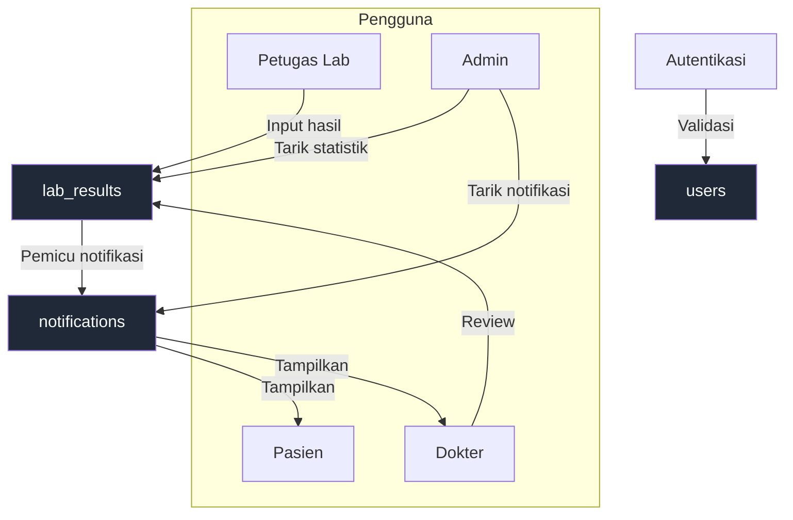

# Diagram Referensi

Folder ini menampung diagram konseptual untuk proyek Hasi Lab Digital: Use Case Diagram, Data Flow Diagram (DFD), dan Entity Relationship Diagram (ERD).  
Semua diagram ditulis dalam sintaks **Mermaid** agar bisa langsung dirender di editor yang mendukung atau dikonversi ke gambar visual.

## Isi diagram

### Use Case Diagram
```mermaid
usecaseDiagram
    actor Pasien
    actor "Petugas Lab" as Lab
    actor Dokter
    actor Admin

    Pasien --> (Masuk)
    Pasien --> (Lihat Hasil Lab)
    Pasien --> (Unduh Berkas)
    Pasien --> (Terima Notifikasi)

    Lab --> (Input / Edit Hasil)
    Lab --> (Unggah Berkas)
    Lab --> (Pantau Daftar Pemeriksaan)

    Dokter --> (Review Hasil Lab)
    Dokter --> (Kirim Notifikasi Pasien)

    Admin --> (Kelola Pengguna)
    Admin --> (Lihat Statistik Sistem)
    Admin --> (Kelola Notifikasi)
```

### Data Flow Diagram (Level 0)


### Entity Relationship Diagram (ERD)
```mermaid
erDiagram
    USERS ||--o{ LAB_RESULTS : pasien
    USERS ||--o{ LAB_RESULTS : dokter
    USERS ||--o{ NOTIFICATIONS : menerima
    LAB_RESULTS ||--o{ NOTIFICATIONS : terkait

    USERS {
        int id PK
        string name
        string email
        string role
        string password
        timestamps
    }
    LAB_RESULTS {
        int id PK
        int patient_id FK
        int doctor_id FK
        string test_type
        text result_value
        string status
        string result_file
        timestamps
    }
    NOTIFICATIONS {
        int id PK
        int user_id FK
        string title
        text body
        int related_result_id FK
        datetime read_at
        timestamps
    }
```

## Visualisasi PNG

- `diagrams/use-case-diagram.png` adalah versi PNG sederhana dari Use Case Diagram untuk ditampilkan langsung di GitHub tanpa Mermaid render.
